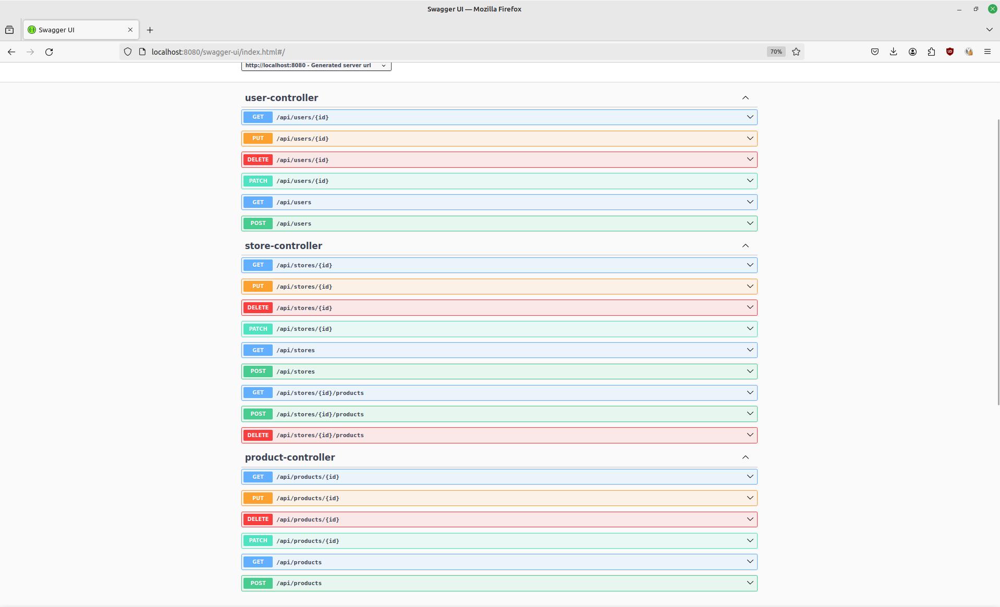

# QRCode generator

[](https://sonarcloud.io/summary/overall?id=MrNaif2018_java-backend-labs)
[](https://sonarcloud.io/summary/overall?id=MrNaif2018_java-backend-labs)

This API provides endpoints to generate QRCodes locally for arbitrary texts, store them and get a permanent URL for reference

## Setup

This project uses PostgreSQL database to store references to saved qrcodes.

Installation steps (for ubuntu 22.04):

```bash
sudo apt install postgresql postgresql-contrib
```

You can configure database password and other connection settings in `src/main/resources/application.yml` (or via environment variables like `SPRING_DB_PASSWORD`)

By default, you need to have database named `java` present. You can create it using:

```bash
sudo -u postgres createdb java
```

The app will run database migrations on boot automatically

Default location for uploaded files is `upload`. You can configure it via `storage.location`

## Running

To run the app, start it from your IDE or use maven:

```bash
mvn spring-boot:test-run
```

You can also run it in docker using docker compose:

```bash
docker compose up -d
```

## Testing

You can run tests using your IDE or maven:

```bash
mvn test
```

## Used stack

- Java 21
- Spring Web 3.2.x series
- PostgreSQL 14
- Maven

## Usage

You can find swagger UI documentation at `http://localhost:8080` and try API requests here


